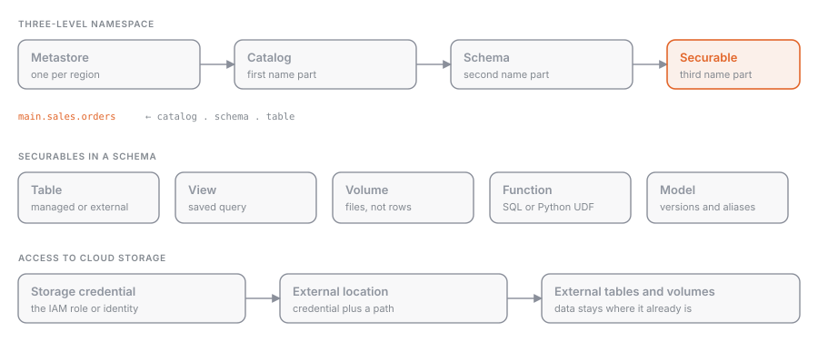

## What it is

**Unity Catalog** is the governance system of Databricks: a single catalog that knows which tables, volumes, functions, and models exist, where their files live, who can do what, and where the data comes from. It lives at the **account** level, not the workspace level: every workspace in a region shares the same **metastore** and therefore the same permissions.

## Why it exists

Before Unity Catalog every workspace had its own **Hive metastore**: two workspaces could not share a table, permissions were configured with local ACLs and local groups, and file access went through cloud credentials mounted on the cluster. Unity Catalog moves everything to the account level and puts the credential in the catalog, not on the compute.

## How it works



### The metastore and the three-level namespace

The **metastore** is the container for everything. Inside it, data objects are addressed with three names:

```
catalog.schema.object
main.sales.orders
```

| Level | Typical role |
| --- | --- |
| **Catalog** | environment or domain: `dev`, `prod`, `finance` |
| **Schema** (database) | functional area: `bronze`, `silver`, `sales` |
| **Object** | table, view, materialized view, streaming table, volume, function, model |

Directly under the metastore, outside the catalog hierarchy, sit the infrastructure objects: **storage credentials**, **external locations**, **connections** (Lakehouse Federation), and **shares** (OpenSharing, formerly Delta Sharing).

### Securable objects

Everything governed is a **securable**: an object on which you `GRANT` to a principal (user, group, service principal). Permissions are inherited downward: a `SELECT` on the catalog applies to every schema and table, present and future. The privilege model is covered in [[privileges-grant-revoke]]; fine-grained controls in [[row-filters-column-masks]] and [[abac-policies]].

### Storage access

Two objects connect the catalog to the cloud:

- **Storage credential**: a long-lived credential (for example an IAM role) that can read and write a bucket.
- **External location**: a path in object storage plus the storage credential that authorizes it.

**Managed** tables write to the managed location defined at the schema level, the catalog level, or, failing that, the metastore level (the most specific level wins). **External** tables point to a path inside an external location. The difference is explored in [[managed-vs-external-tables]].

### Lineage and audit

Unity Catalog automatically records **lineage** at the table and column level: which notebooks, jobs, pipelines, and dashboards read or write each object. Every access ends up in the audit **system tables**. There is nothing to configure: you just use catalog objects with compatible compute.

### hive_metastore

In workspaces with Unity Catalog, the old metastore appears as a catalog named `hive_metastore`. Its tables can be queried (`hive_metastore.default.vecchia_tabella`) but they have no lineage, no audit, and none of the Unity Catalog permission model, and they are not visible from other workspaces.

| | Hive metastore | Unity Catalog |
| --- | --- | --- |
| Scope | one workspace | account, multi-workspace |
| Namespace | `schema.table` (two levels) | `catalog.schema.object` |
| Groups | workspace-local | account-level |
| Storage credentials | on the cluster (instance profile, mount) | in the catalog (storage credential) |
| Lineage and audit | no | yes, automatic |
| `DENY` | yes | no, replaced by policies |

## Example

Minimal setup of a production catalog with its storage and a first table:

```sql
CREATE EXTERNAL LOCATION prod_data
  URL 's3://acme-prod-data/'
  WITH (STORAGE CREDENTIAL acme_prod_role);

CREATE CATALOG prod
  MANAGED LOCATION 's3://acme-prod-data/managed/';

CREATE SCHEMA prod.sales;

CREATE TABLE prod.sales.orders (id BIGINT, amount DECIMAL(10,2), order_date DATE);

GRANT USE CATALOG ON CATALOG prod TO `analysts`;
GRANT USE SCHEMA ON SCHEMA prod.sales TO `analysts`;
GRANT SELECT ON TABLE prod.sales.orders TO `analysts`;
```

```python
spark.sql("CREATE SCHEMA IF NOT EXISTS prod.sales")
df.write.saveAsTable("prod.sales.orders")
spark.sql("GRANT SELECT ON TABLE prod.sales.orders TO `analysts`")
```

## Common mistakes

- Omitting the catalog from the table name and landing in the workspace's default catalog (which may be `hive_metastore` in older workspaces).
- Granting `SELECT` on a table without `USE CATALOG` and `USE SCHEMA` on the levels above: the user cannot see it.
- Confusing storage credential and external location: the first is the key, the second is the door the key opens.
- Creating an external location that is too broad (the whole bucket) and then being unable to create more specific ones: paths cannot overlap.

> [!exam]
> The exam asks what Unity Catalog does (centralized governance: permissions, lineage, audit, discovery), how the namespace is shaped (three levels, with the metastore above the catalog), what the objects are (catalog, schema, table, view, volume, function, model), and what storage credentials and external locations are for. Know that it is account-level and shared across workspaces, and that `hive_metastore` is the legacy metastore without governance.
