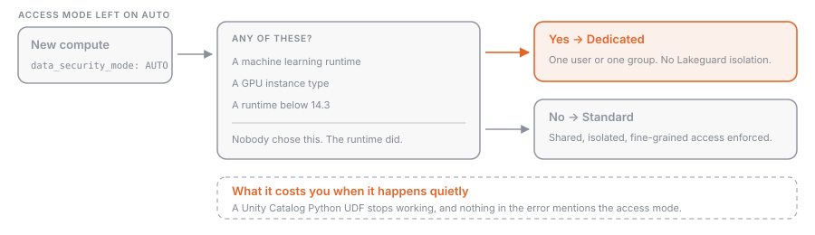

## What it is

**Access mode** is the setting on a classic compute resource that decides who may attach to it and what data they can reach through it. Every all-purpose and job compute resource has one. In the UI it sits under **Advanced**; in the API it is `data_security_mode`.

There are two modes you would choose today. **Standard** is shared: any number of users with permission attach and run work concurrently, isolated from each other's data and credentials. **Dedicated** is private: the resource is assigned to one user or one group, and only they can use it.

This is a governance setting, not a sizing setting. Which _kind_ of compute to use, and what it costs, is [[compute-options]].

### Auto is the default



Left alone, the UI sets access mode to **Auto** and picks for you: Standard, unless you selected a machine learning runtime, a GPU instance type, or a Databricks Runtime lower than 14.3, in which case Dedicated. So a cluster can quietly become dedicated because somebody picked an ML runtime, and then a Unity Catalog Python UDF stops working for reasons that look unrelated.

## Why it exists

In the classic Spark architecture, user code shares a JVM that has privileged access to the underlying machine. Two people on one cluster therefore meant two people who could read each other's data, so the historical choice was stark: a cluster each, paying for the idle time, or a shared cluster with no Scala, few UDFs and a long list of missing Spark APIs.

**Lakeguard** changed the trade. It isolates user code from the Spark driver using Spark Connect, so clients no longer share a JVM or a classpath with it, and sandboxes each client and each UDF in its own container. Because that isolation is in place, standard compute can enforce fine-grained access controls natively, with no risk of a user reaching the unfiltered base data before a row filter runs. That is why the recommendation inverted: Databricks now recommends standard unless the workload needs something standard cannot do, and what remains all comes down to privileged access to the machine.

## How it works

### The two modes

|                             | Standard                                                              | Dedicated                                                               |
| --------------------------- | --------------------------------------------------------------------- | ----------------------------------------------------------------------- |
| Who can use it              | any user with permission, concurrently                                | the one assigned user, or the one assigned group                        |
| Languages                   | Python, SQL, Scala (13.3 LTS and above, with Unity Catalog). **No R** | Python, SQL, Scala, R                                                   |
| Isolation                   | Lakeguard: user code isolated from the engine and from other users    | none: classic Spark architecture, privileged machine access             |
| Fine-grained access control | enforced natively                                                     | delegated to serverless compute                                         |
| Recommended for             | most workloads, including ETL and collaborative notebooks             | RDD APIs, GPUs, R, Databricks Runtime for ML, privileged machine access |

### The old names

The modes were renamed, the exam guides were not. Both sets of names appear in the API to this day.

| UI today  | UI before   | Current API value              | Legacy alias     |
| --------- | ----------- | ------------------------------ | ---------------- |
| Standard  | Shared      | `DATA_SECURITY_MODE_STANDARD`  | `USER_ISOLATION` |
| Dedicated | Single user | `DATA_SECURITY_MODE_DEDICATED` | `SINGLE_USER`    |
| Auto      | n/a         | `DATA_SECURITY_MODE_AUTO`      | n/a              |

`data_security_mode` also still accepts `NONE` and four `LEGACY_*` values (`LEGACY_TABLE_ACL`, `LEGACY_PASSTHROUGH`, `LEGACY_SINGLE_USER`, `LEGACY_SINGLE_USER_STANDARD`) left over from table ACL clusters and credential passthrough. Those are deprecated from Databricks Runtime 15.0 and will be removed in a future runtime. Do not build anything on them.

### What standard mode blocks

One idea repeated: anything that reaches past Spark into the machine is gone.

- Databricks Runtime for ML is not supported (install ML libraries as compute-scoped libraries), and neither is GPU-enabled compute.
- **R is not supported.** Scala works from 13.3 LTS with Unity Catalog, but `sc`, `spark.sparkContext` and `sqlContext` are not available to it.
- **RDD APIs are not supported**, and `spark.createDataFrame` from local data caps a row at 128 MB.
- `spark-submit` job tasks are not supported; use a JAR task. Hive UDFs are not supported; use Unity Catalog UDFs (see [[udfs-and-alternatives]]).
- Code runs as a low-privilege user. POSIX-style DBFS paths do not work, and nothing can reach the instance metadata service or the Databricks VPC, so cloud access goes through external locations and service credentials rather than instance profiles.
- On Databricks Runtime 19 and above a set of Spark configuration properties is restricted outright, including `spark.driver.extraJavaOptions`, `spark.jars` and `spark.executorEnv.*`. A cluster that sets one fails to create.

### What dedicated mode blocks

Fewer entries, and they surprise people, because "dedicated can do everything" is the folk wisdom.

- **Unity Catalog Python UDFs are not supported on dedicated compute.** Use standard, serverless, a serverless or pro SQL warehouse, or a Lakeflow pipeline.
- Fine-grained access control requires a serverless-enabled workspace and Databricks Runtime **15.4 LTS or above** for reads, **16.3 or above** for writes. Behind a firewall, ports **8443-8451** must be open.
- On Databricks Runtime 15.3 or below a dedicated cluster cannot read a table with a row filter or column mask at all, cannot use dynamic views, and needs `SELECT` on every table a view references.
- Querying a streaming table or materialized view somebody else created needs serverless enablement and Databricks Runtime 15.4 or above.

The mechanism behind the middle two is worth knowing. Dedicated compute cannot apply [[row-filters-column-masks|row filters and column masks]] in place without risking over-fetching, so when a query touches a filtered object it hands the filtering to the workspace's Lakeguard-isolated serverless compute and gets the filtered rows back through temporary files in internal storage. That is why fine-grained access control on dedicated compute needs serverless turned on at all.

### Dedicated to a group

> [!note]
> Group access for dedicated compute is in **Public Preview** as of September 2026. Read it to know it exists, and check the limitations before you plan a platform around it.

Group assignment is what makes dedicated compute affordable for a team that needs R or RDDs. It needs Unity Catalog, Databricks Runtime **15.4 or above**, and `CAN MANAGE` for the group on a workspace folder to keep its notebooks in.

The behaviour is a role switch, not a shortcut. When a user attaches to a group cluster, their own permissions are replaced by the **group's** for every operation on that cluster, and objects they create are owned by the group. Individual permissions cannot be enforced, because every member shares the Spark environment. The audit trail records both identities: `identity_metadata.run_by` is the authenticating user, `identity_metadata.run_as` is the authorising group.

Sharp edges: jobs created through the API or SDK cannot be assigned group access, because `run_as` takes a single user or service principal; jobs that check out Git fail, so use Git folders; and `%run` uses the user's permissions while `dbutils.notebook.run()` uses the group's, which is a subtle way to get two answers from one notebook.

## Example: choosing a mode, and declaring it

| Workload                                                | Mode                                                                           | Why                                                            |
| ------------------------------------------------------- | ------------------------------------------------------------------------------ | -------------------------------------------------------------- |
| Shared ETL cluster for the data team                    | Standard                                                                       | Lakeguard isolation, one resource for everybody                |
| Notebook using a Unity Catalog Python UDF               | Standard                                                                       | dedicated does not support them                                |
| Distributed training on GPUs with Databricks Runtime ML | Dedicated                                                                      | standard supports neither                                      |
| An R team that wants one cluster between them           | Dedicated, assigned to the group                                               | R needs dedicated; group access avoids one cluster per analyst |
| A query against a table with a column mask              | either, but dedicated needs Databricks Runtime 15.4 LTS and serverless enabled | standard enforces the mask itself                              |

Declaring it explicitly in a bundle beats relying on Auto:

```yaml
resources:
  jobs:
    etl_sales:
      job_clusters:
        - job_cluster_key: shared
          new_cluster:
            spark_version: 16.4.x-scala2.12
            node_type_id: m5.xlarge
            num_workers: 4
            data_security_mode: DATA_SECURITY_MODE_STANDARD

        - job_cluster_key: training
          new_cluster:
            spark_version: 16.4.x-cpu-ml-scala2.12
            node_type_id: m5.xlarge
            num_workers: 2
            data_security_mode: DATA_SECURITY_MODE_DEDICATED
            single_user_name: sp-ml-training # the identity the resource is dedicated to
```

A [[cluster-policies|compute policy]] that fixes `data_security_mode` is how you stop the choice being made by accident across a workspace.

## Common mistakes

- **Leaving access mode on Auto and then debugging the consequence.** Pick an ML runtime and you get Dedicated, which silently removes Unity Catalog Python UDFs. Set the mode explicitly.
- **Reading "dedicated" as "more capable".** It has fewer language restrictions and weaker governance. Fine-grained access control on dedicated compute is a delegation to serverless with its own runtime floor, not a native capability.
- **Expecting R or an RDD job to run on standard compute.** Neither is supported at any runtime version. This is the check to run before a migration, not after.
- **Assuming a group cluster keeps individual permissions.** Every action uses the group's permissions, and every object created is owned by the group. If the group cannot read a table, no member can read it there.
- **Bringing a `spark.driver.extraJavaOptions` habit to Databricks Runtime 19.** On standard mode the cluster will not even start. Move dependencies to compute-scoped libraries.

> [!exam]
> The exam still uses the old names. **Shared is Standard** (`USER_ISOLATION`, multiple isolated users, Python, SQL and Scala, no R) and **Single user is Dedicated** (`SINGLE_USER`, one user or group, adds R, RDDs, GPUs and Databricks Runtime ML). Standard is the recommended default and the mode required for Unity Catalog Python UDFs; dedicated needs Databricks Runtime 15.4 LTS and a serverless-enabled workspace before it can read a table carrying a row filter or column mask. Typical question: "a shared cluster needs to run an R notebook" → it cannot, that workload needs dedicated.
