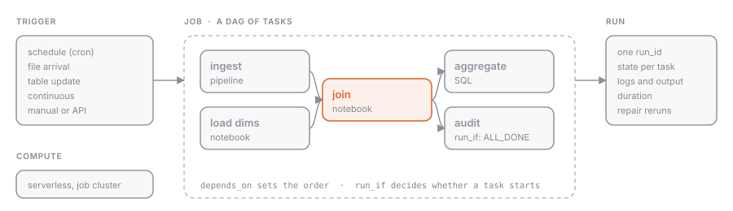

## What it is

A **job** is the object Databricks uses to run work non-interactively: a set of **tasks** connected by dependencies, executed on a compute you choose, started by a **trigger** (manual, scheduled, on file arrival, on table update), and observed through runs, notifications, and metrics.

The product is called **Lakeflow Jobs**. Until 2025 it showed up in the sidebar as *Workflows*, and plenty of material still uses that name. In the API the term remains `jobs`.

## Why it exists

A notebook you launch by hand is not a production process. There is no answer to "who starts it", "what happens if it fails", "which version of the code is running", or "where do the logs go". A job answers all of those in one place: a declarative definition (UI, API, CLI, or bundle, see [[bundles-overview]]), run history, retries, notifications, and permissions.

## How it works



A job has three levels.

**Job**: name, owner, job parameters (see [[jobs-parameters]]), trigger (see [[jobs-triggers]]), concurrency limits, notifications, tags, and permissions.

**Task**: the unit of work. Each task has a type, a compute, and optionally dependencies on other tasks. The types you need to recognize:

| Task type | What it runs | When to use it |
| --- | --- | --- |
| Notebook | a notebook from the workspace or a Git folder | transformations, exploration promoted to production |
| Python script / wheel | a `.py` file or a wheel package | tested code, internal libraries |
| SQL | a saved query, a `.sql` file, an alert, or a dashboard refresh on a SQL warehouse | pure SQL steps, refreshing BI objects |
| Pipeline | a Lakeflow Spark Declarative Pipeline (see [[pipelines-overview]]) | declarative ingestion and transformation |
| Dashboard | a refresh of an AI/BI dashboard | closing the ETL chain with the business-facing output |
| dbt | a dbt project | teams already working with dbt |
| Run job | another job | composing reusable jobs |
| If/else, For each | control flow (see [[jobs-control-flow]]) | conditional branches, loops over lists |

**Run**: a single execution of the job. Every run has a `run_id`, a state for each task, logs, duration, and output. Run history is the foundation of monitoring (see [[runs-monitoring]]).

### Compute

Each task can run on:

- **serverless**: the recommended default, no cluster to manage, starts in seconds;
- **job cluster**: a cluster created for the run and torn down at the end, defined in the job;
- **existing all-purpose cluster**: not recommended in production, costs more and mixes interactive workloads in.

SQL tasks run on a **SQL warehouse** instead. Choosing between these is covered in [[compute-options]].

## Example

A typical ETL job has four tasks: ingestion (pipeline), cleaning (notebook), aggregation (SQL), and a dashboard refresh. In a bundle it is declared like this:

```yaml
resources:
  jobs:
    daily_sales:
      name: daily_sales
      tasks:
        - task_key: ingest
          pipeline_task:
            pipeline_id: ${resources.pipelines.bronze_sales.id}
        - task_key: clean
          depends_on: [{ task_key: ingest }]
          notebook_task:
            notebook_path: ./notebooks/clean_sales.py
        - task_key: aggregate
          depends_on: [{ task_key: clean }]
          sql_task:
            warehouse_id: ${var.warehouse_id}
            file: { path: ./sql/aggregate_sales.sql }
        - task_key: refresh_dashboard
          depends_on: [{ task_key: aggregate }]
          dashboard_task:
            dashboard_id: ${var.dashboard_id}
```

The same job can be created from code with the SDK:

{{snippet: jobs-create-sdk}}

## Common mistakes

- Using an all-purpose cluster for a scheduled job: you pay the interactive rate and compete for resources with users.
- Putting all the logic in one giant notebook task: you lose the ability to rerun only the piece that failed (see [[jobs-repair-runs]]).
- Confusing **job parameters** with **task parameters**: the former are visible to every task, the latter only to their own task.
- Forgetting failure notifications: the job fails silently and you find out from an empty dashboard.

> [!exam]
> The exam asks you to recognize the task types (notebook, SQL query, dashboard, pipeline) and to understand that a job is a **DAG**: tasks with dependencies, not a sequential list. Expect questions where you have to pick the right task type for a need ("refresh a dashboard at the end of the ETL" → dashboard task) and questions about choosing compute (serverless or job cluster, never all-purpose in production).
