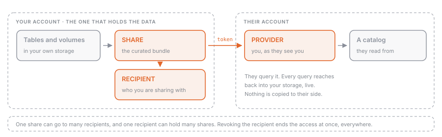

## What it is

**OpenSharing** is the protocol and the set of Unity Catalog objects that let you give an outside organisation live read access to data you hold, without sending them a copy. Three securables carry the whole model: a **share** is the curated bundle of assets, a **recipient** is the organisation you are sharing with, and a **provider** is what the recipient sees on their side representing you.

[[marketplace-delta-sharing]] is the map: what sharing is for, how Marketplace and Clean Rooms sit on top of it, and how the two sharing models differ in one table. This page is the terrain: the objects you create, the credentials that hold the connection together, the options that decide whether a recipient can time travel or stream, and the list of things that cannot be shared at all.

## Why it exists

The default way data leaves an organisation is a copy: a nightly extract, an S3 bucket someone was granted access to, a file dropped on SFTP. Every copy is stale from the moment it is written, has to be regenerated on a schedule nobody owns, and cannot be taken back. Revoking access to an extract someone already downloaded is not a thing you can do.

OpenSharing inverts that. The provider registers what may be read; the recipient reads the actual files through short-lived, path-scoped credentials issued at query time. Nothing is duplicated, updates show up in near real time, access is revocable on demand, and every access lands in the provider's audit log alongside ordinary Unity Catalog activity. Because the protocol is open and has connectors for Spark, pandas, Power BI and others, the recipient does not have to be a Databricks customer for any of that to hold.

## How it works

### The three objects and their lifecycle



| Object | Lives in | Created by | Deleting it |
| --- | --- | --- | --- |
| Share | the provider's metastore | provider, with the `CREATE SHARE` privilege | every recipient loses access to it |
| Recipient | the provider's metastore | provider, with the `CREATE RECIPIENT` privilege | that organisation loses every share |
| Provider | the recipient's metastore | created for them when the share is granted | the recipient loses that provider's shares |

A share holds assets from exactly one metastore, so an organisation sharing from three metastores has to define the recipient three times, once per metastore. Assets can be added and removed at any time, and grants revoked at any time.

One sharp edge: deleting a parent object cascades to its children **even if those children sit in an active share**, and after a cascade delete you cannot re-add an asset with the same name to that share. Remove assets from shares before dropping the catalog or schema that holds them.

### What can go in a share

Tables and table partitions, streaming tables, managed Iceberg tables, foreign tables and schemas, views including dynamic views, materialized views, metric views, volumes, Python UDFs, notebooks, AI models, Genie Agents and FeatureSpecs. Sharing a whole schema shares everything in it, including assets added later.

But only the Databricks-to-Databricks path carries the non-tabular half. Notebooks, volumes, models and metric views are D2D-only; an open recipient gets tables and views.

What you cannot share at all: tables with row filters or column masks (see [[row-filters-column-masks]]), tables with collations enabled, `SHALLOW CLONE` tables, tables using liquid clustering with partition filtering, and R2 tables with V2 checkpoint. Foreign key constraints do not survive into a shared table. Tabular data has to be Delta or managed Iceberg.

### Two protocols, three ways to authenticate

| | Databricks-to-Databricks (D2D) | Open sharing, bearer token | Open sharing, OIDC federation |
| --- | --- | --- | --- |
| Recipient needs | a Unity Catalog-enabled workspace | any Delta Sharing client | an identity provider |
| Credential | the recipient's **sharing identifier**, no token at all | a long-lived bearer token you send via an activation link | short-lived Databricks OAuth tokens exchanged for the recipient's JWTs |
| Provider manages | nothing | token lifetime, rotation, revocation | the federation config |
| Assets | everything, including notebooks, volumes, models | tables and views | tables and views |

`CREATE RECIPIENT` decides which one you get: with `USING ID '<sharing-identifier>'` the recipient's `authentication_type` is `DATABRICKS`, without it the type is `TOKEN` and Databricks hands you an activation link to pass to them over a secure channel. OIDC federation is the option to reach for when a long-lived bearer token is not acceptable to your security team and the recipient is not on Databricks.

### Sharing with history

`WITH HISTORY` on a table share is the option people miss, and it decides more than its name suggests. Sharing history lets the recipient run [[delta-time-travel|time travel]] queries, read the table as a Structured Streaming source, and run transactions. On Databricks-to-Databricks shares it also shares the Delta log, which is what allows cloud tokens (temporary credentials scoped to the table's root directory) and therefore performance comparable to reading the source table directly.

It requires Databricks Runtime 12.2 LTS or above, and is the default when the compute creating the share runs Databricks Runtime 16.2 or above; on earlier runtimes the default is `WITHOUT HISTORY`. Schema shares are `WITH HISTORY` by default regardless. If you also want the recipient to call `table_changes()` on the share, enable [[change-data-feed]] on the table **before** you share it with history.

Note what history sharing exposes: credentials scoped to the table root grant read access to the Delta log too, which carries the commit history, who committed, and deleted data that has not been vacuumed yet.

### Narrowing what a recipient sees

Three mechanisms, in increasing order of subtlety:

- a **partition specification** on `ALTER SHARE ... ADD TABLE`, so only some partitions are exposed;
- **recipient properties**, set on the recipient and read back with `CURRENT_RECIPIENT().<key>` in the partition clause, so one share serves several recipients and each sees their own slice;
- **dynamic views**, which filter rows and mask columns based on recipient properties. Views are the only route here, because row filters and column masks on the table itself make it unshareable.

A partition filter, however, disqualifies a table from cloud-token access, so the slice is materialised and filtered on the provider's side instead.

### What it costs

Sharing inside a region incurs no egress cost, because nothing is replicated. Across regions or clouds, the cloud vendor charges its usual egress, unless the provider uses SecureConnect, in which case Databricks bills the transfer. Compute is charged to whoever runs it: a recipient on serverless, or on classic compute in the same account, reads the underlying data directly and pays for it; a recipient on classic compute in a different account, or any open-sharing connector, causes the provider to do the filtering on the provider's serverless SKU.

> [!warning]
> Sharing **foreign tables** (assets reached through [[lakehouse-federation]]) is in **Beta** as of September 2026. Materialisation always happens on the provider's side and may show up as default storage charges, with no compute cost during the Beta. Know that it exists; do not build a delivery commitment on it.

### Where the rename leaves you

The capability is called OpenSharing in the docs and the product UI; the open-source protocol and the table format are still Delta Sharing and Delta. Exam guides, including the current Data Engineer Professional guide, still say "delta sharing" and "Delta Share". They are the same thing. The abbreviations **D2D** and **D2O** appear in exam material and mean Databricks-to-Databricks and Databricks-to-Open.

## Example: one share, two recipients, one slice each

```sql
CREATE SHARE regional_sales
  COMMENT 'Order lines, partitioned per partner country';

-- share with history so the recipient can time travel and stream
ALTER SHARE regional_sales
  ADD TABLE main.gold.order_lines
  PARTITION (country = CURRENT_RECIPIENT().country)
  AS gold.order_lines
  WITH HISTORY;

-- a Databricks recipient: no token, identified by their metastore sharing id
CREATE RECIPIENT acme
  USING ID 'aws:eu-west-1:f12dcb34-5678-9d4c-1234-c5ac67f8b90a'
  PROPERTIES (country = 'IT');

-- a non-Databricks recipient: Databricks issues an activation link and a token
CREATE RECIPIENT partner_bi
  PROPERTIES (country = 'ES');

GRANT SELECT ON SHARE regional_sales TO RECIPIENT acme;
GRANT SELECT ON SHARE regional_sales TO RECIPIENT partner_bi;

DESCRIBE RECIPIENT partner_bi;   -- authentication_type TOKEN, activation_link, token expiry
```

Both recipients query a table called `gold.order_lines` and each sees only their own country. Adding a third partner is two statements, not a new pipeline.

## Common mistakes

- **Sharing a table without `WITH HISTORY` and then being asked for time travel or a streaming read.** Neither works, and on older runtimes `WITHOUT HISTORY` is the silent default. Fixing it means altering the share.
- **Putting a row filter or column mask on a table you intend to share.** The table becomes unshareable. Filter with a dynamic view and recipient properties instead.
- **Dropping the catalog or schema behind a share.** The cascade delete goes through the share, and the asset name is then burned for that share.
- **Treating the bearer token as a low-risk credential because it is read-only.** It is long-lived by default. Set a lifetime, apply IP access lists, and prefer OIDC federation or D2D where you can.
- **Assuming an open recipient can receive volumes, models or notebooks.** That half of the asset list exists only on the Databricks-to-Databricks path.
- **Sharing across regions without checking the bill.** No replication means no egress within a region, but a cross-region share moves bytes and someone pays for them.

> [!exam]
> The objective is worded around D2D and D2O, so know the split cold: D2D needs the recipient's sharing identifier and no token, supports notebooks, volumes and models, and is enabled by default between metastores in the same account; D2O needs a bearer token or OIDC federation and carries tables and views only. Know the three securables and that deleting a recipient revokes every share it had. `WITH HISTORY` is the answer whenever a question mentions time travel, streaming from a share, or `table_changes()`. And treat "Delta Sharing" in the exam guide and "OpenSharing" in the docs as the same feature.
