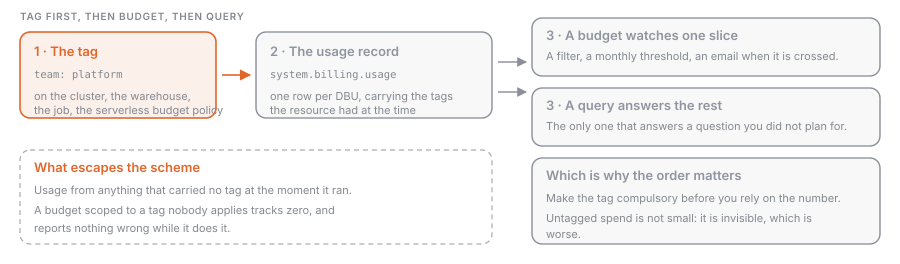

## What it is

Cost attribution is the practice of making every DBU answerable to a team, a project or a cost centre. On Databricks it is three mechanisms, and they are not interchangeable. **Tags** put a `key:value` label on a compute resource, and that label follows the usage into the billing record. **Budgets** watch a filtered slice of spend against a monthly threshold and email somebody when it is crossed. **`system.billing.usage`** is where the numbers live, and it is the only one of the three that can answer a question you did not think to ask in advance.

Tag first, then budget, then query. A budget scoped to a tag nobody applies tracks zero.

## Why it exists

The invoice arrives as an amount per SKU per workspace per day, and no team owns a SKU. Before tags propagated into the billing records, a chargeback model meant a spreadsheet mapping cluster names to owners, and that spreadsheet was wrong within a fortnight, because people rename clusters and leave. Tags record the attribution at the moment the usage happens, by the platform. Budgets are the difference between finding out in the monthly review and finding out on the day.

## How it works



### Default tags

Databricks tags the compute it deploys in your cloud account without being asked. These tags identify the resource and propagate to AWS EC2 and EBS instances, so they show up in cloud-side cost analysis too.

| Resource                     | Default tag keys                                                                                                       |
| ---------------------------- | ---------------------------------------------------------------------------------------------------------------------- |
| All-purpose and jobs compute | `Vendor` (always `Databricks`), `ClusterId`, `ClusterName`, `Creator`, plus `RunName` and `JobId` on jobs compute only |
| SQL warehouses               | `Vendor`, `ClusterId`, `SqlEndpointId`, `Creator`                                                                      |
| Pools                        | `Vendor`, `DatabricksInstancePoolId`, `DatabricksInstancePoolCreatorId`                                                |

Two details worth holding on to: `Creator` is whoever created the resource, not necessarily whoever benefits from the work on it, and `RunName` is the job name under Jobs API 2.0 but the `task_key` under Jobs API 2.1, so it is not a stable key to group by.

### Custom tags, and where they propagate

Custom tags are yours. You can set them on a workspace (Account API only, there is no UI), a pool, all-purpose and job compute, a SQL warehouse, a database instance and a Lakebase Autoscaling project, and they reach both the billing records and the applicable cloud resources.

The propagation rule that catches everybody is pools. If a cluster comes from a pool, its EC2 instances inherit the workspace tags and the pool tags, **not** the cluster tags. So if your clusters come from pools (see [[instance-pools]]), the cost-centre tag has to live on the pool or the workspace. Cluster and pool tags both reach the usage records either way.

Conflicts resolve by prefixing: a custom tag whose key matches a Databricks default is renamed with an `x_` prefix, so a custom `vendor = AWS Databricks` arrives as `x_vendor` while the default keeps its name. The exception is nasty. A conflicting key added by a **compute policy** does not auto-resolve, and the cluster fails to launch with an invalid settings error. Never set a custom `Name` tag on a cluster either; Databricks owns that key, and overwriting it means the cluster stops being tracked, up to and including not being terminated when idle.

Other limits: no spaces and no `/` in keys or values; a key change applies only after a cluster restart or pool expansion; workspace tags take up to an hour to propagate; 20 tags maximum on a workspace resource.

### Making tags compulsory

A tag scheme nobody follows does not exist. Compute policies (see [[cluster-policies]]) enforce one with the `custom_tags.<tag-name>` attribute, and anyone using the policy must pick an allowed value or the compute does not start:

```json
{ "custom_tags.COST_CENTER": { "type": "allowlist", "values": ["9999", "9921", "9531"] } }
```

### Tagging serverless usage

> [!warning]
> **Serverless usage policies are in Public Preview** as of September 2026. They are the only documented way to tag serverless usage, so you cannot avoid them if you run serverless, but treat the surface as movable.

None of the above applies to [[serverless-compute|serverless]], because there is no cluster of yours to tag. Instead a workspace admin creates a **serverless usage policy**, a named bag of custom tags, and grants users the `User` or `Manager` permission on it. Any serverless notebook, job, Lakeflow pipeline, model serving endpoint or app created by an assigned user carries the policy's tags, and those land in the `custom_tags` column. The policy id is recorded as `usage_metadata.usage_policy_id`; the older `usage_metadata.budget_policy_id` is deprecated and should not appear in new queries.

Behaviours to plan around: a user assigned one policy gets it automatically, a user assigned several must choose, and the first alphabetically wins if they do not; existing assets are not retro-assigned when their owner is granted a policy; a pipeline triggered by a job does not inherit the job's policy; and edits apply only to usage started after the change.

### Budgets

A budget is an account-level object created by an account admin under **Usage → Budgets** in the account console, scoped by workspace, resource type and custom tags; an empty scope means the whole account. Workspace admins can create budgets for workspaces they administer through **Governance Hub**, whose consolidated Cost page is in **Beta** as of September 2026.

| Property              | Value                                                                   |
| --------------------- | ----------------------------------------------------------------------- |
| Currency and pricing  | USD at SKU **list price**, including platform add-ons                   |
| Credits and discounts | not applied, so the figure is above your real invoice                   |
| Thresholds            | up to **4** per budget, each a unique monthly amount plus an email list |
| Budgets per account   | up to **1,000**                                                         |
| Alert latency         | up to **24 hours** between usage and the email                          |
| Blocking              | only for budgets scoped to Unity Gateway, and only approximately        |

That last row is the one people misread. A normal budget observes; it does not cap. Only a budget scoped to the Unity Gateway product can optionally block further requests, and it alone gets near-real-time tracking and a per-user threshold with overrides. Even there, enforcement is documented as approximate, and requests already in flight are not interrupted.

### Where the answer actually comes from

Tags and budgets are inputs; `system.billing.usage` is the record. One row per unit of consumption, with `custom_tags` as a map, `usage_metadata` naming the job, cluster, warehouse or pipeline behind the row, and `identity_metadata` naming the identity. Records are typically available within 12 hours. `usage_quantity` is DBUs, not money, so every cost figure joins `system.billing.list_prices` on the SKU and the price validity window; [[system-tables]] covers that table and the grants needed to read it.

One subtlety specific to cost work: the table carries corrections. A correction adds a `RETRACTION` row with a negative `usage_quantity` and then a `RESTATEMENT` with the right figures, so aggregating every `record_type` nets out. Filter to `record_type = 'ORIGINAL'` and you report figures Databricks has already withdrawn.

## Example: spend by cost centre, and what escapes the scheme

```sql
WITH priced AS (
  SELECT
    coalesce(u.custom_tags['COST_CENTER'], 'untagged')  AS cost_centre,
    u.usage_quantity * p.pricing.effective_list         AS usd
  FROM system.billing.usage u
  JOIN system.billing.list_prices p
    ON  u.sku_name = p.sku_name
    AND u.usage_start_time >= p.price_start_time
    AND (p.price_end_time IS NULL OR u.usage_start_time < p.price_end_time)
    AND p.currency_code = 'USD'
  WHERE u.usage_date >= date_trunc('MONTH', current_date())  -- every record_type, so corrections net out
)
SELECT cost_centre, ROUND(SUM(usd), 2) AS usd
FROM priced
GROUP BY cost_centre
ORDER BY usd DESC;
```

The `untagged` bucket is the useful output. The second query says what is in it, which tells you whether the hole is a classic cluster that dodged the policy or serverless usage with no policy attached:

```sql
SELECT
  billing_origin_product,
  usage_metadata.usage_policy_id AS serverless_policy,
  ROUND(SUM(usage_quantity), 1)  AS dbus
FROM system.billing.usage
WHERE usage_date >= current_date() - INTERVAL 30 DAYS
  AND NOT map_contains_key(custom_tags, 'COST_CENTER')
GROUP BY ALL
ORDER BY dbus DESC;
```

## Common mistakes

- **Creating the budget before the tags.** A budget filtered on `COST_CENTER = 9999` reports zero until something is tagged, and zero looks like good news.
- **Tagging clusters that come from a pool.** The cluster tags never reach the instances. Put the tag on the pool or the workspace.
- **Expecting a budget to stop spending.** Outside Unity Gateway they only notify, up to 24 hours late. If you need a ceiling, cap what people can create with a compute policy.
- **Reconciling a budget alert against `system.billing.usage` minutes later and calling it a bug.** The three surfaces update at different rates and the system table is the source of truth. Compare them a day apart.
- **Adding a conflicting tag key through a compute policy.** Everywhere else the platform renames your key with `x_`; through a policy the cluster refuses to launch.
- **Treating a serverless usage policy as a permission boundary.** It attributes cost, nothing more, and deleting one leaves its id on the asset applying no tags at all.

> [!exam]
> For the Professional exam, know the three layers and which question each one answers: tags attribute, budgets alert, `system.billing.usage` reports. Be precise about serverless, where cluster tags do not exist and **serverless usage policies** (Public Preview) do the tagging, landing in `custom_tags` and `usage_metadata.usage_policy_id`. Remember that budgets are list price in USD with no discounts applied, at most four thresholds each, and that they notify rather than cap outside Unity Gateway.
