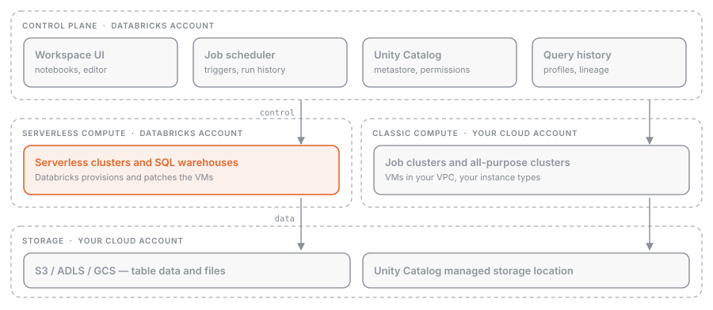

## What it is

The **Data Intelligence Platform** is the name Databricks gives to the set of services it offers on top of a public cloud (AWS, Azure, GCP). The underlying idea is the **lakehouse**: data stays in cheap, open object storage, but on top of it you get transactions, governance, and data-warehouse-grade performance. For the exam you need to recognize the pieces and where each one runs: control plane, compute plane, storage, [[delta-lake-overview|Delta Lake]], and [[unity-catalog-overview|Unity Catalog]].

## Why it exists

A "pure" data lake (Parquet files on S3) is cheap but fragile: no transactions, no table-level permissions, every team reinvents the catalog. A classic data warehouse solves those problems but locks the data into a proprietary format and charges accordingly. The platform keeps the data in the customer's cloud, in an open format, and adds the missing services as separate layers.

## How it works



### Control plane and compute plane

| Layer | Where it runs | What it contains |
| --- | --- | --- |
| **Control plane** | Databricks cloud account | web app, APIs, management of jobs, notebooks, configuration, Unity Catalog metadata |
| **Classic compute plane** | customer's cloud account | classic/pro clusters and SQL warehouses that process the data |
| **Serverless compute plane** | Databricks cloud account, same region as the workspace | serverless compute for notebooks, jobs, pipelines, and serverless SQL warehouses |

The control plane doesn't process data: it orchestrates. The compute plane is where Spark reads and writes. The difference between **classic** and **serverless** is who owns the machines: in classic they are VMs in your account, in serverless they are managed by Databricks inside an isolated perimeter per workspace. Choosing between the two is covered in [[compute-options]].

### Workspace

The **workspace** is the environment where users work: notebooks, folders, [[git-folders|Git folders]], dashboards, jobs, clusters. A Databricks **account** can have many workspaces; with Unity Catalog, users, groups, and data are managed at the account level and shared across workspaces in the same region.

Each workspace has a **storage bucket** in the customer's cloud, holding two kinds of content:

- **workspace file system**: notebooks, files, libraries, queries;
- **workspace system data**: SQL query results, job output, cluster logs, notebook revisions.

### Data storage

Tables live in object storage (S3, ADLS, GCS) in the customer's account. Databricks doesn't "own" the data: it reads and writes it through credentials managed by Unity Catalog (storage credentials and external locations). Legacy **DBFS** is the old file system mounted on the workspace; today it is discouraged for data and replaced by Unity Catalog tables and volumes.

### Delta Lake

The default table format. Every table created in Databricks is a Delta table unless you specify otherwise: Parquet files plus a transaction log that provides ACID, time travel, and schema enforcement. Details in [[delta-lake-overview]].

### Unity Catalog

The governance layer: one **metastore** per region, a three-level namespace `catalog.schema.object`, permissions, lineage, and audit that are the same for every attached workspace. Details in [[unity-catalog-overview]].

### How you pay

The unit of measure is the **DBU** (Databricks Unit), processing capacity per hour that depends on the instance type and the kind of compute. In classic you pay DBUs to Databricks and VMs to the cloud provider; in serverless the DBUs include the infrastructure.

## Example

A typical scenario for a data team:

1. The engineer opens a notebook in the workspace (control plane) and attaches it to serverless compute.
2. The notebook reads CSV files from a Unity Catalog volume and writes a Delta table: reading and writing happen in the compute plane, on the customer's bucket.
3. Unity Catalog registers the table in the metastore, enforces permissions, and tracks lineage.
4. A scheduled job (see [[jobs-overview]]) reruns the notebook every night; the job definition lives in the control plane, the execution in the compute plane.

From SQL or Python the flow is identical:

```sql
CREATE TABLE main.sales.orders AS
SELECT * FROM read_files('/Volumes/main/raw/landing/orders/', format => 'csv');
```

```python
df = spark.read.format("csv").option("header", "true").load("/Volumes/main/raw/landing/orders/")
df.write.saveAsTable("main.sales.orders")
```

## Common mistakes

- Thinking the data "lives in Databricks": it sits in your object storage; the platform only keeps metadata and logs in the control plane.
- Confusing workspace and account: workspaces are working environments, the account is the container that governs them (users, metastore, billing).
- Believing serverless runs in your cloud: it runs in the Databricks account, with per-workspace network isolation.
- Using DBFS as a data store: it is legacy and not governed by Unity Catalog.

> [!exam]
> The "Databricks Intelligence Platform" domain carries little weight (6%) but the questions are blunt: "where does the control plane run?" (Databricks account), "where does the data live?" (customer's object storage), "what sets the serverless compute plane apart?" (resources managed by Databricks, in its own account), "what is the default table format?" (Delta), "what does Unity Catalog provide?" (centralized governance with a three-level namespace). Recognize the three pieces, control plane, compute plane, and storage, and be able to say who owns what.
