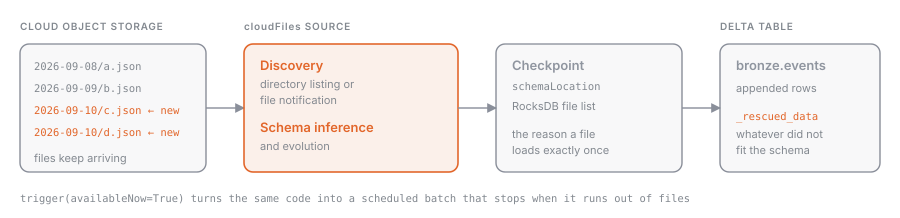

## What it is

**Auto Loader** is a Structured Streaming source, identified by the `cloudFiles` format, that watches a directory in S3, ADLS, GCS, or a Unity Catalog volume and processes files as they arrive. It reads JSON, CSV, XML, Parquet, Avro, ORC, text, and binary files. It keeps the list of already-processed files in a **checkpoint** (backed by RocksDB), so every file is loaded **exactly once**, even after a crash or a restart.

## Why it exists

Listing a directory with millions of files on every run is slow and expensive, and hand-maintaining a list of files you have already seen is fragile. Auto Loader solves both problems: it discovers new files efficiently and remembers its state in the checkpoint. On top of that, it handles two things that always happen with real-world files: you don't know the schema up front, and the schema changes over time.

## How it works



### Reading and writing

```python
(spark.readStream.format("cloudFiles")
  .option("cloudFiles.format", "json")
  .option("cloudFiles.schemaLocation", "<checkpoint path>")
  .load("<source path>")
  .writeStream
  .option("checkpointLocation", "<checkpoint path>")
  .toTable("<catalog>.<schema>.<table>"))
```

`cloudFiles.format` tells Auto Loader the file format. `cloudFiles.schemaLocation` is where it stores the inferred schema (in a `_schemas` subfolder) and its history; it usually matches the checkpoint location.

### File discovery: directory listing or file notification

| Mode | How it finds files | When to use it |
| --- | --- | --- |
| **Directory listing** (default) | lists the directory, incrementally when file names are lexically ordered | zero setup, moderate volumes |
| **File notification** | receives events from the storage service (`cloudFiles.useNotifications = true`, or `cloudFiles.useManagedFileEvents = true` with file events on a Unity Catalog external location) | millions of files per hour, low latency, lower listing costs |

Unity Catalog-managed **file events** are the recommended path: a single queue per external location, shared by every stream, with automatic backfill. They require Runtime 14.3 LTS or later.

### Schema inference

If you don't pass a schema, Auto Loader infers one by sampling the first 50 GB or 1000 files (both thresholds are configurable). For JSON, CSV, and XML every column is inferred as **string** unless you set `cloudFiles.inferColumnTypes = true`; Parquet and Avro use their embedded schema. With `cloudFiles.schemaHints` (`"data DATE, amount DECIMAL(10,2)"`) you can fix individual columns without spelling out the whole schema.

### Schema evolution

`cloudFiles.schemaEvolutionMode` decides what happens when a new column shows up:

| Mode | Behavior |
| --- | --- |
| `addNewColumns` (default without a schema) | updates the schema and **stops the stream** with `UnknownFieldException`; on restart it picks up the new columns |
| `addNewColumnsWithTypeWidening` | same as above, and widens compatible types (`int` → `long`) |
| `rescue` | never fails: new columns land in `_rescued_data` |
| `failOnNewColumns` | fails and stays down until you update the schema by hand |
| `none` (default with an explicit schema) | ignores new columns |

The stop in `addNewColumns` is intentional: that's why Auto Loader in production runs inside a Lakeflow job with retries, which restarts it automatically.

### Schema enforcement and `_rescued_data`

Auto Loader adds a `_rescued_data` column (renameable with `rescuedDataColumn`) where it stores, as JSON, everything that doesn't fit the schema: unexpected columns, values with the wrong type, casing mismatches. Nothing is lost, and you can inspect the problematic records after the fact.

### Incremental batch with `availableNow`

An always-on stream costs money. With `.trigger(availableNow=True)` Auto Loader processes every file that arrived before it started and then **exits**. Scheduled in a job, or kicked off by a file arrival trigger (see [[jobs-triggers]]), it becomes an incremental batch load with streaming guarantees. `cloudFiles.maxFilesPerTrigger` (default 1000) caps the size of each micro-batch.

## Example

Landing JSON events in a bronze table, hourly batch, schema evolution in rescue mode:

```python
checkpoint = "/Volumes/shop/landing/_checkpoints/eventi"

(spark.readStream.format("cloudFiles")
  .option("cloudFiles.format", "json")
  .option("cloudFiles.schemaLocation", checkpoint)
  .option("cloudFiles.inferColumnTypes", "true")
  .option("cloudFiles.schemaEvolutionMode", "rescue")
  .option("cloudFiles.schemaHints", "event_ts TIMESTAMP")
  .load("s3://shop-landing/eventi/")
  .writeStream
  .option("checkpointLocation", checkpoint)
  .trigger(availableNow=True)
  .toTable("shop.bronze.eventi"))
```

In SQL, inside a declarative pipeline (see [[pipelines-overview]]) or in Databricks SQL, the equivalent is a streaming table over `read_files` with `cloudFiles`:

```sql
CREATE OR REFRESH STREAMING TABLE shop.bronze.eventi
AS SELECT *, _metadata.file_path AS source_file
FROM STREAM read_files(
  's3://shop-landing/eventi/',
  format => 'json',
  inferColumnTypes => true,
  schemaEvolutionMode => 'rescue'
);
```

## Common mistakes

- Changing `checkpointLocation`: Auto Loader forgets what it has loaded and reloads everything.
- Not understanding why the stream "fails" at the first new column: that's the `addNewColumns` default; you need a job with retries or the `rescue` mode.
- Leaving every column as string in a JSON feed because you never set `inferColumnTypes`.
- Using directory listing with millions of files: cost and latency explode; switch to file notification.
- Never looking at `_rescued_data`: malformed records pile up silently.

> [!exam]
> The exam uses the exact names: `cloudFiles`, `cloudFiles.schemaLocation`, `cloudFiles.schemaEvolutionMode` with the values `addNewColumns`, `rescue`, `failOnNewColumns`, `none`, the `_rescued_data` column, and the two discovery modes, **directory listing** and **file notification**. Know that with `addNewColumns` the stream stops and restarts with the updated schema, that `rescue` never stops, and that `trigger(availableNow=True)` turns Auto Loader into an incremental batch. Compared with [[copy-into]]: Auto Loader for high volumes and changing schemas, `COPY INTO` for a handful of files in SQL.
