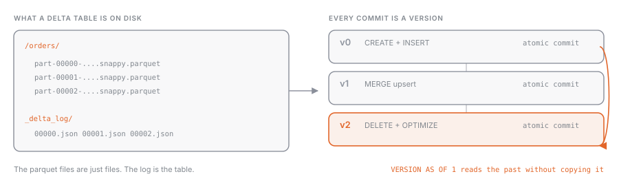

## What it is

**Delta Lake** is the default table format on Databricks. A Delta table is a folder in object storage with two things inside: the data files in **Parquet** and a `_delta_log/` subfolder holding the **transaction log**, a sequence of JSON files (plus Parquet checkpoints) that records every commit. The log protocol is open, so any engine that understands it can read the table.

## Why it exists

Parquet on its own is a file format, not a table format. If two jobs write to the same folder, or one reads while another deletes files, the outcome is unpredictable; if a job fails halfway through, partial files are left behind; if someone adds a column with the wrong type, nobody notices. The transaction log fixes all of this by giving the folder the semantics of a database table.

## How it works



### ACID transactions

Every write (INSERT, UPDATE, DELETE, MERGE, OPTIMIZE) produces a new **version**: it adds or removes Parquet files and writes a commit to the log. Readers always see the latest complete version, never an intermediate state. A failed job leaves no dirty data behind: without a commit, the files it wrote are invisible.

### Time travel

The log keeps past versions, so you can query the table as it was:

```sql
SELECT * FROM main.sales.orders VERSION AS OF 12;
SELECT * FROM main.sales.orders TIMESTAMP AS OF '2026-09-01T00:00:00Z';
RESTORE TABLE main.sales.orders TO VERSION AS OF 12;
```

```python
spark.read.option("versionAsOf", 12).table("main.sales.orders")
spark.read.option("timestampAsOf", "2026-09-01").table("main.sales.orders")
spark.sql("RESTORE TABLE main.sales.orders TO VERSION AS OF 12")
```

`RESTORE` doesn't erase history: it creates a new version identical to the one you picked. There's also the short form `table@v12`.

Time travel is not a backup. Two properties control how far back you can go:

| Property | Default | What it controls |
| --- | --- | --- |
| `delta.logRetentionDuration` | 30 days | how long the commit log is kept |
| `delta.deletedFileRetentionDuration` | 7 days | how long `VACUUM` keeps files that are no longer referenced |

If the files of a version have been removed by `VACUUM`, that version is no longer readable even if the log entry still exists.

### Schema enforcement and evolution

On write, Delta compares the schema of the incoming data with the table's schema. New columns, incompatible types, or names that differ only by case make the write **fail**. That's by design: better an error than a phantom column. When you actually want evolution, you ask for it explicitly:

```sql
ALTER TABLE main.sales.orders ADD COLUMNS (canale STRING);
```

```python
(df.write
   .option("mergeSchema", "true")
   .mode("append")
   .saveAsTable("main.sales.orders"))
```

`overwriteSchema` replaces the schema entirely during an overwrite. The session config `spark.databricks.delta.schema.autoMerge.enabled` exists but is discouraged in production.

### History

```sql
DESCRIBE HISTORY main.sales.orders;
DESCRIBE HISTORY main.sales.orders LIMIT 5;
```

Returns one row per version with `version`, `timestamp`, `userName`, `operation` (WRITE, MERGE, DELETE, OPTIMIZE…), `operationParameters`, and metrics such as rows written. It's the first place to look when a table "changed and I don't know who did it".

### Maintenance

- **OPTIMIZE**: compacts many small files into large ones; streaming and frequent appends produce a lot of them.
- **VACUUM**: physically deletes files that no recent version uses anymore, honoring the retention period (default 7 days).
- Managed tables in Unity Catalog can delegate both to **predictive optimization** (see [[liquid-clustering]]).

## Example

An overnight job runs a bad `DELETE` on the silver table. The next morning:

```sql
DESCRIBE HISTORY main.silver.customers LIMIT 3;
-- version 41: DELETE, 120000 rows removed, userName job-etl
SELECT COUNT(*) FROM main.silver.customers VERSION AS OF 40;
RESTORE TABLE main.silver.customers TO VERSION AS OF 40;
```

Version 42 is now identical to 40, and 41 stays available for post-mortem analysis.

## Common mistakes

- Using time travel as a historical archive: after `VACUUM`, old versions are no longer readable.
- Running `VACUUM ... RETAIN 0 HOURS` to free up space: it breaks in-flight reads and any chance of recovery.
- Sidestepping schema enforcement with `mergeSchema` enabled by default in every job: wrong columns slip in silently.
- Expecting `RESTORE` to delete later versions: it adds a version, it doesn't rewrite history.
- Writing Parquet "by hand" into a Delta table's folder: the log doesn't know about it, so the files are either invisible or corrupt the table.

> [!exam]
> Typical questions: "which component gives Delta its ACID guarantees?" (the transaction log), "how do you read a previous version?" (`VERSION AS OF` or `TIMESTAMP AS OF`), "how do you go back to a version?" (`RESTORE TABLE`), "how do you see who modified the table?" (`DESCRIBE HISTORY`), "what happens if you write an extra column?" (the write fails due to schema enforcement, unless `mergeSchema` is set). Remember the defaults: 7-day retention for `VACUUM`, Delta as the default format for every table.
