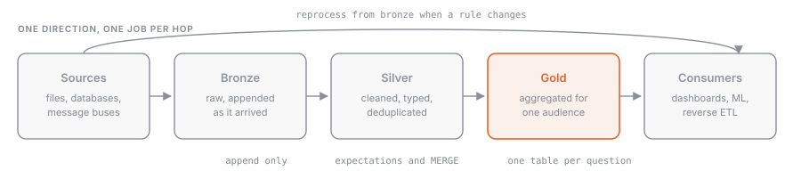

## What it is

The **medallion architecture** organizes the tables of a lakehouse into three layers, each with a different quality guarantee:

| Layer | What it holds | Who reads it |
| --- | --- | --- |
| **Bronze** | raw data exactly as it arrives from the source, plus technical columns (source file, ingestion timestamp) | pipelines only |
| **Silver** | validated, typed, deduplicated data, with at least one row per source record, no aggregations | data engineers, data scientists |
| **Gold** | aggregates and models built for a specific use: dashboards, reports, features | analysts, business users |

It isn't a platform requirement, just a recommended practice: Databricks proposes it as a reference pattern, and the exam treats it as shared vocabulary.

## Why it exists

Writing a "clean" table straight from the source looks like a shortcut, but it's fragile: if the source schema changes, the pipeline breaks and data stops arriving. With a bronze layer that accepts everything (ideally as `STRING` or `VARIANT`), the raw data is safe, and the cleanup logic in silver can be fixed and rerun as many times as needed. Gold, in turn, insulates the business from technical details: if the dedup logic in silver changes, the dashboard keeps reading the same gold table.

## How it works



Each step is a batch or incremental transformation between Delta tables registered in Unity Catalog (see [[unity-catalog-overview]]). The typical pattern is one schema per layer (`bronze`, `silver`, `gold`) inside a catalog per environment.

**Bronze**: append-only, fed by [[auto-loader]], [[copy-into]], or [[lakeflow-connect]]. You add columns such as `_ingested_at` and `_source_file`. Almost nothing gets transformed.

**Silver**: this is where the cleanup the exam asks about happens:

1. handle nulls (`dropna` on keys, `fillna` on optional values);
2. standardize types (`cast`, `to_date`, `to_timestamp`) and strings (`trim`, `lower`);
3. deduplicate (see [[dataframe-dedup-aggregations]]);
4. apply quality rules (see [[pipelines-expectations]]).

**Gold**: aggregations and joins by business domain, often as a materialized view (see [[gold-layer-objects]]).

Writing to silver uses three tools, in order of frequency: `saveAsTable` / `CREATE OR REPLACE TABLE AS SELECT` when you rebuild everything, `MERGE INTO` when you only update the records that changed, and `append` for purely incremental data.

## Example

Bronze holding orders in raw form (every column a string), and silver with correct types.

```sql
CREATE OR REPLACE TABLE shop.silver.orders AS
SELECT
  CAST(order_id AS BIGINT)          AS order_id,
  TRIM(LOWER(customer_email))       AS customer_email,
  TO_DATE(order_date, 'yyyy-MM-dd') AS order_date,
  CAST(amount AS DECIMAL(10, 2))    AS amount,
  COALESCE(channel, 'unknown')      AS channel
FROM shop.bronze.orders_raw
WHERE order_id IS NOT NULL
  AND order_date IS NOT NULL;
```

```python
from pyspark.sql import functions as F

bronze = spark.read.table("shop.bronze.orders_raw")

silver = (
    bronze
    .dropna(subset=["order_id", "order_date"])
    .fillna({"channel": "unknown"})
    .select(
        F.col("order_id").cast("bigint").alias("order_id"),
        F.trim(F.lower("customer_email")).alias("customer_email"),
        F.to_date("order_date", "yyyy-MM-dd").alias("order_date"),
        F.col("amount").cast("decimal(10,2)").alias("amount"),
        F.col("channel"),
    )
)

silver.write.mode("overwrite").saveAsTable("shop.silver.orders")
```

When bronze also receives corrections to orders already seen, a full rebuild wastes time. You use `MERGE` to upsert instead:

```sql
MERGE INTO shop.silver.orders AS t
USING (
  SELECT CAST(order_id AS BIGINT) AS order_id,
         CAST(amount AS DECIMAL(10, 2)) AS amount,
         TO_DATE(order_date) AS order_date
  FROM shop.bronze.orders_raw
  WHERE _ingested_at > current_date() - INTERVAL 1 DAY
) AS s
ON t.order_id = s.order_id
WHEN MATCHED THEN UPDATE SET amount = s.amount, order_date = s.order_date
WHEN NOT MATCHED THEN INSERT *;
```

```python
from delta.tables import DeltaTable

target = DeltaTable.forName(spark, "shop.silver.orders")

(target.alias("t")
   .merge(updates.alias("s"), "t.order_id = s.order_id")
   .whenMatchedUpdate(set={"amount": "s.amount", "order_date": "s.order_date"})
   .whenNotMatchedInsertAll()
   .execute())
```

Unlike pandas, `dropna` and `fillna` don't modify the DataFrame in place: they return a new DataFrame, and nothing is computed until you write it out.

## Common mistakes

- Casting in bronze: if a value isn't convertible you lose the raw record, and with `spark.sql.ansi.enabled = true` (the default on serverless) the cast fails instead of returning `NULL`.
- Using `mode("overwrite")` on a silver table fed incrementally: it wipes out the history. You need `MERGE` or `append`.
- Skipping silver and feeding gold straight from bronze: every dashboard redoes the same cleanup, with different results.
- Aggregating in silver: silver should stay at record granularity, so it can serve several different gold tables.

> [!exam]
> The questions are hands-on: "which code reads a bronze table, drops rows with a null key, converts a string to a date, and writes a silver table?" You need to recognize `dropna`/`fillna`, `cast`/`to_date`, `saveAsTable`, and the SQL equivalent `CREATE OR REPLACE TABLE … AS SELECT`. Remember the definition of each layer: bronze raw and append-only, silver clean and not aggregated, gold aggregated for the business.
